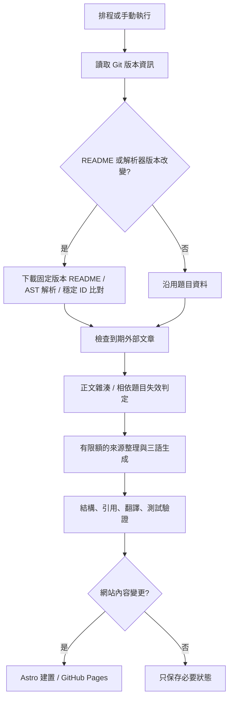

# Recall 架構與維護

這是一個完全靜態的三語面試題卡網站。讀者不會呼叫 LLM；資料處理與生成只在本機命令或 GitHub Actions 執行。

## 前端

每題有永久題號與三個獨立網址。繁中為首次開啟預設；之後記住語言偏好，直接指定的網址語言優先。`lang/` 維護三份相同鍵值的介面文字與標籤名稱；题目內容放在 `data/`。

題卡預設收折答案，提示與完整答案各自展開。答案依原理、Trade-off、Implementation、Production 排列。原始英文、README 內的答案文字、作者提供的全部文章／影片連結均可查看。每張卡與展開答案都提供固定 commit 的原題連結及原始 repo 連結。

Filter 支援標籤任一／全部符合，再與公司、關鍵字、已有答案條件組合。預設依永久題號排序。隨機採用有 seed 的洗牌，範圍內同輪不重複。條件、seed 與目前題目可分享；實際前後瀏覽歷史另存 sessionStorage，切換模式時保留過去歷史，捨棄不再適用的未來路徑。換題會收起提示與答案。

## 資料界線

- `data/questions/`：題目原文、永久 ID、分類與原始位置。
- `data/answers/`：四段式解答、提示、三語版本、生成及引用紀錄。
- `data/sources/`：文章網址、狀態、正文雜湊、ETag；嚴格 schema 禁止混入全文。
- `.private/`：只在執行環境保存擷取正文，不進 Git、網站、公開 cache 或 artifact。
- `data/state/`：上游版本、解析器版本、失敗重試及已審閱的來源基準。
- `data/overrides/`：完整的人工編輯答案。設 `pin: true` 後不會被模型覆蓋；來源變更會標記待更新。

## 增量更新

Git 版本資訊用於避免重複下載 README。README 有變更才完整解析，再依題目原文及上下文保留 ID。移動與重新排序不改號；無法可靠對應的改寫會得到新 ID，舊題保留為已移除狀態。大量刪題預設阻止同步，需檢查後明確使用 `--allow-removals`。解析器版本改變也會重新解析，避免修正邏輯後資料永遠停在舊格式。

外部文章與 README 各自追蹤。文章預設七天到期，失敗較早重試。可用時採條件式請求；抽取正文後再雜湊，避免導覽與廣告造成生成。相同網址只維護一份。公開 Actions 沒有保存私有正文，因此需要生成的文章在新 runner 上可能重新下載；設有抓取上限。

答案雜湊包含原始題目、原始答案與解答連結、參考文章版本、模型與 prompt 版本。公司、分類與 Tag 的純 metadata 變更不會重跑 LLM。每次只處理待生成或失效的題目，失敗可接續；沒有文章來源的題目不占用模型呼叫額度。本文字驗證能阻止缺欄位、無效來源 URL 與過期結果被當成新答案，但不等於驗證全部技術論述正確。

## 部署與目前界線

已提供每日排程、手動執行、驗證、建置與 GitHub Pages 工作流程。只在網站資料變更、程式 push 或明確要求部署時建置／發布。狀態與資料在驗證後才提交；部署使用同一次流程產生的 artifact。失敗時不替換已發布版本。

目前有 598 題及 8 題完整三語初始答案。這 8 題是實際閱讀外部來源後，由 AI 整理的示例；其餘 590 題顯示待生成。環境尚未配置 LLM 金鑰與模型，未執行付費模型請求；provider 流程已使用本機測試伺服器驗證，但真實 provider 相容性待設定後驗證。只有影片、社群或缺少參考資料的題目，仍需補充支援的文章來源。

尚未建立遠端 repository 或公開部署。完整操作與必要環境變數見專案 README。
